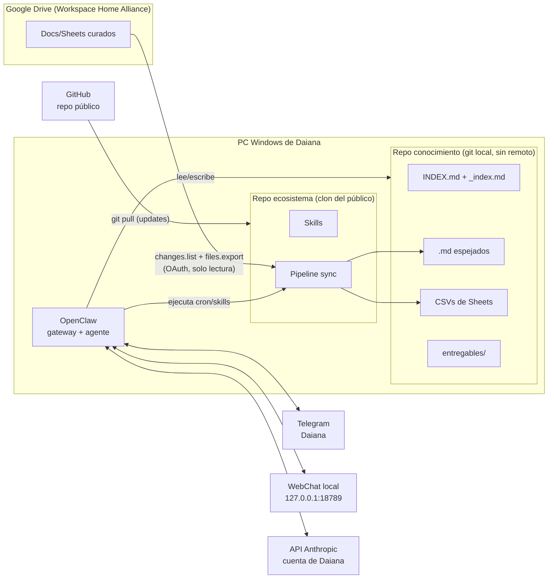

# Diseño — Knowledge Hub (ecosistema OpenClaw)

> Documento de diseño técnico. Materializa los requisitos de
> [analisis-requisitos.md](analisis-requisitos.md) (referenciados como RF/RNF/C/D).
> Las decisiones de diseño se registran como **DD-XX** (§11).
>
> Fecha: 2026-07-09 · Autor: Cristian Osorio

---

## 1. Arquitectura general



Piezas:

| Componente | Rol | Requisitos que cubre |
|---|---|---|
| **Repo ecosistema** (este, público) | Instalador, pipeline, skills, plantillas, config de OpenClaw. Canal de updates vía `git pull`. | RF-01/02/03, C-02 |
| **Repo conocimiento** (privado, git local) | Espejo `.md`/CSV + índices + entregables. Sin remoto. | RNF-01, C-02 |
| **OpenClaw** | Agente conversacional (canales Telegram + WebChat local), ejecutor de cron jobs y skills, clasificador de cambios, generador de resúmenes e índices. | RF-13/25…33/40…42 |
| **Pipeline de sync** (Python) | Parte determinista: OAuth, `changes.list`, export, conversión, commits. Invocado por skill. | RF-10…15 |

Principio de separación: **lo determinista va en scripts** (descargar, convertir,
commitear — barato, testeable, sin tokens); **lo que requiere criterio va en el
agente** (clasificar importancia, resumir, avisar, clasificar documentos nuevos en
el esqueleto).

## 2. Layout en disco

```
C:\clawhub\
├── ecosystem\                  # clon del repo público (actualizable, RF-03)
│   ├── install.ps1             # bootstrap (RF-01)
│   ├── pipeline\               # sync.py, convert.py, manifest.py …
│   ├── skills\                 # ver §8
│   ├── templates\              # esqueleto del repo conocimiento, plantillas de índice
│   └── docs\
├── knowledge\                  # repo privado, git local SIN remoto
│   └── (ver §5)
└── (estado/credenciales fuera de ambos repos, ver §9)
```

## 3. Sincronización Drive → espejo local

### 3.1 Autenticación (RF-10, D-13)

- **OAuth 2.0 desktop flow (loopback)** con la cuenta corporativa de Daiana,
  scope de **solo lectura** (`drive.readonly`) — refuerza RF-15 por permiso, no
  solo por convención.
- El OAuth client pertenece a un **proyecto GCP de Cristian** y su client-id viaja
  en el repo público (**DD-12**; para apps desktop el client-id no es secreto).
  Riesgo asociado: app sin verificar → pantalla de advertencia; el admin del
  Workspace puede bloquear apps de terceros (S-01). **Primer paso de la
  implementación: probar el flujo con la cuenta real de Daiana** antes de construir
  encima.
- Refresh token guardado fuera de los repos (§9).

### 3.2 Detección de cambios (RF-14, DD-01)

- `changes.getStartPageToken` al configurar; el token se persiste en el manifest.
- Cada corrida: `changes.list(pageToken)` → lista de archivos cambiados desde la
  corrida anterior → se filtra contra la **selección curada** (lista de `drive_id`
  de carpetas/archivos en el manifest; los cambios fuera de ella se descartan).
- Por cada archivo cambiado se pide metadata con
  `fields=modifiedTime,lastModifyingUser,name,mimeType,parents` → cubre fecha y
  autor (valida S-02).
- **Sin push notifications**: `changes.watch` exige webhook HTTPS público con SSL y
  renovación de canales — infraestructura injustificada en una PC hogareña cuando
  el requisito es sync programado + manual (D-03).

### 3.3 Export y conversión (RF-12, DD-02)

| Origen | Método | Resultado en el espejo |
|---|---|---|
| Google Doc | `files.export` → `text/markdown` (nativo de la API, límite 10 MB) | `<slug>.md` |
| Google Sheet | Sheets API / export **CSV por hoja** | `<slug>.md` (ficha) + `<slug>.data/<hoja>.csv` |
| docx/xlsx/pdf subidos | descarga + **markitdown** (fallback) | `<slug>.md` |

- **Sheets = datos, no prosa**: el `.md` de un Sheet es una *ficha* (frontmatter,
  resumen, esquema de columnas por hoja, wikilinks); los números viven en CSV y el
  agente **calcula con código (pandas) en vez de leer tablas en tokens** — clave
  para RF-27 con RNF-03.
- **Imágenes** (el export md las trae en base64): el pipeline las extrae a
  `_assets/<slug>/img-N.png` y deja el link relativo (**DD-04**). El md queda
  liviano; las imágenes disponibles si el agente necesita mirarlas.
- **Granularidad 1:1** (DD-11): cada archivo de Drive = un `.md`. Los documentos
  largos no se parten; su TOC (headings) se publica en el `_index.md` del área para
  que el agente lea solo la sección necesaria (grep por heading + lectura parcial).
- Documento que supere el límite de export de 10 MB: se registra en el manifest
  como `error: export-limit` y se le avisa a Daiana en el digest (caso esperado:
  Docs con muchas imágenes).

### 3.4 Commit y trazabilidad (RF-14, RF-29, DD-16)

Un commit por archivo cambiado, en el repo conocimiento:

```
sync(ventas): reporte-ventas — Nick actualizó los números del 8-jul

Fuente: https://docs.google.com/spreadsheets/d/…
Modificado en Drive: 2026-07-08 14:32 por Nick R.
Importancia: rutinario
```

- `GIT_AUTHOR_NAME/EMAIL` = `lastModifyingUser` de Drive → `git log` responde
  "quién cambió qué y cuándo" en los términos de Daiana, sin exponerle git (D-11).
- La primera línea la redacta Claw al analizar el diff (mismo turno del sync);
  si el análisis falla, el pipeline commitea con mensaje genérico y Claw lo
  enriquece en la corrida siguiente (el sync **nunca** queda bloqueado por el LLM).
- RF-29 ("¿qué cambió esta semana en ventas?") se resuelve con `git log`/`git diff`
  leídos por el agente y traducidos a lenguaje natural.

### 3.5 Flujo completo de una corrida

1. **Pipeline (determinista)**: `changes.list` → filtrar curados → export/convertir
   → extraer imágenes → escribir espejo → commit por archivo → actualizar manifest.
2. **Agente (criterio)**: por cada commit nuevo — leer diff → redactar resumen del
   cambio → actualizar resumen del doc y `_index.md` del área si cambió el
   contenido sustancialmente (DD-07) → clasificar importancia (§6) → avisar/acumular.
3. Documentos **nuevos**: el agente propone ubicación en el esqueleto (D-06),
   genera frontmatter y resumen, y lo deja en `_index.md` marcado `pendiente de
   validación` hasta el OK de Daiana (RF-21).

### 3.6 Disparadores y cadencia (D-03, cierra PA-02)

- **Programado**: cron job de OpenClaw (**DD-03**), default **diario 07:00** hora
  de Daiana (antes de su jornada; los datos de ventas del día anterior ya están
  cargados). Parámetro configurable conversando ("sincronizá dos veces por día").
- **Manual**: "actualizá la documentación" en el chat dispara la misma skill.
- **Digest** (RF-31): cron semanal, **lunes 08:00**, resume todos los commits de la
  semana agrupados por área.

### 3.7 Curaduría: cómo entra un archivo a la selección (DD-17/DD-18)

La **fuente de verdad** es `_meta/manifest.json`: lista de entradas curadas
(`drive_id`, tipo archivo/carpeta, ruta destino en el esqueleto, estado). Nadie la
edita a mano; se alimenta por dos vías equivalentes:

1. **Link por chat**: Daiana pega una URL de Drive en Telegram → la skill
   `curaduria` extrae el `drive_id`, lo registra en el manifest y **espeja al
   toque** (export + clasificación + resumen en el mismo turno). Sirve para
   archivos sueltos y carpetas.
2. **Carpeta `Knowledge` en su Drive**: una carpeta raíz convenida (creada en el
   onboarding) donde ella suelta **atajos** o archivos desde la UI de Google
   (PC o celular, sin hablar con el bot). El sync la trata como carpeta curada
   permanente: todo lo que aparezca ahí entra solo en la corrida siguiente.
   Los atajos (`application/vnd.google-apps.shortcut`) se resuelven a su
   `targetId` real antes de registrar.

**Semántica de carpetas** (DD-18): curar una carpeta = todo su contenido presente
y futuro, recursivo. Un archivo nuevo en carpeta curada se espeja
automáticamente, Claw lo clasifica en el esqueleto y queda `estado:
pendiente-validacion` (RF-21) — se menciona en el próximo digest, sin interrumpir.
La baja también existe: "dejá de seguir X" → se remueve del manifest y el espejo
local se archiva (no se borra el historial git).

### 3.8 Optimización de descargas

- **Delta primero**: `changes.list` (§3.2) ya limita cada corrida a lo que cambió;
  no se re-lista ni re-baja el corpus.
- **Skip por versión**: el manifest guarda `version`/`md5Checksum` (binarios) y
  `modifiedTime` por archivo; si el cambio reportado no altera contenido
  (ej. solo se movió o renombró), se actualiza metadata sin re-exportar.
- **Import inicial**: recorrido `files.list` por carpeta curada (paginado, solo
  `fields` necesarios) + export archivo por archivo con **backoff exponencial**
  ante 403/429 (rate limits de la API). El primer sync completo puede tardar; es
  una sola vez y corre desatendido durante el onboarding.
- **Un export por cambio real**: los Docs solo se re-exportan si `modifiedTime`
  avanzó; de los Sheets se re-exportan solo las hojas (CSV) cuyo contenido cambió
  cuando la Sheets API permite compararlo barato, si no, la Sheet completa.

## 4. Organización del conocimiento: jerarquía + wikilinks (DD-05)

**Modelo híbrido**: la **jerarquía** (esqueleto de dos contextos, D-06) es el
camino de búsqueda — le da al agente un punto de entrada barato con lectura
progresiva raíz → área → documento. Los **wikilinks** son la capa de relaciones
transversales — el grafo que Daiana necesita para "este número sale de tal doc y
alimenta tal reporte", imposible de expresar con carpetas.

Regla de oro anti-tokens (va en el `AGENTS.md` del repo conocimiento, §7):
> Nunca escanear el corpus. Entrar siempre por `INDEX.md` → `_index.md` del área →
> documento (sección, si hay TOC). Para números, ejecutar código sobre los CSV.
> Seguir wikilinks solo cuando la consulta cruza áreas.

## 5. Estructura del repo conocimiento

```
knowledge\
├── INDEX.md                      # nivel 1: mapa de contextos y áreas (~1 pantalla)
├── AGENTS.md                     # reglas de navegación y trabajo para el agente
├── cleanora\                     # contexto 1: Cleanora como negocio
│   ├── _index.md                 # nivel 2: una línea por doc del área
│   ├── estrategia\
│   ├── marketing\
│   ├── ventas\
│   │   ├── _index.md
│   │   ├── reporte-ventas.md            # ficha del Sheet
│   │   ├── reporte-ventas.data\         # CSV por hoja
│   │   │   ├── daily.csv
│   │   │   └── summary.csv
│   │   └── _assets\
│   ├── operaciones\              # dispatching, técnicos
│   ├── rrhh\
│   └── finanzas\
├── home-alliance\                # contexto 2: Cleanora dentro de la estructura
│   ├── _index.md
│   ├── estructura\               # jerarquía, quién es quién, accesos
│   ├── reportes\                 # qué piden, formato, de dónde sale cada número
│   └── departamentos\            # marketing For A/B/C, call center…
├── entregables\                  # lo que genera Claw (reportes, presentaciones)
└── _meta\
    ├── manifest.json             # drive_id→ruta, pageToken, selección curada, errores
    └── config.yml                # cadencias, defaults de importancia por carpeta
```

### 5.1 Frontmatter (DD-08, cubre los 4 grupos de D-metadata)

```yaml
---
titulo: Manual de políticas de operaciones
# — trazabilidad a Drive (RF-14)
drive_id: 1AbC…
drive_url: https://docs.google.com/document/d/…
modificado: 2026-07-05T09:12:00Z
modificado_por: Daiana G.
# — clasificación (RF-20/21)
contexto: cleanora          # cleanora | home-alliance
area: operaciones
tipo: politica              # politica | reporte | scorecard | manual | procedimiento | otro
estado: validado            # validado | pendiente-validacion
# — importancia para avisos (RF-30, §6)
importancia: critico        # critico | normal | rutinario
# — relaciones (grafo explícito)
related:
  - "[[reporte-ventas]]"
  - "[[home-alliance/reportes/scorecard-mensual]]"
resumen: >
  Políticas operativas de Cleanora: horarios, dispatching, manejo de reclamos.
  Fuente del material de capacitación de agosto.
---
```

### 5.2 Índices de dos niveles (DD-06)

`INDEX.md` (raíz — estable, editado solo cuando cambia el esqueleto):

```markdown
# Conocimiento Cleanora / Home Alliance
## Cleanora como negocio
- [ventas](cleanora/ventas/_index.md) — pipeline comercial, reporte diario de Nick, métricas
- [operaciones](cleanora/operaciones/_index.md) — dispatching, técnicos, manual de políticas
…
## Cleanora dentro de Home Alliance
- [reportes](home-alliance/reportes/_index.md) — qué pide gerencia, plantillas, fuentes de cada número
…
```

`_index.md` de área (mantenido por Claw en cada sync, DD-07):

```markdown
# Ventas — Cleanora
| Documento | Qué es | Actualiza | Último cambio |
|---|---|---|---|
| [[reporte-ventas]] | Ventas diarias por canal; hojas: daily, summary | Nick, diario | 2026-07-08 |
| [[politicas-ventas]] | Política comercial y descuentos §TOC: precios, descuentos, reembolsos | Daiana | 2026-06-30 |
```

Presupuesto de lectura por consulta típica: `INDEX.md` (~150 tokens) +
`_index.md` (~300) + documento/sección objetivo — contra decenas de miles si se
escaneara el corpus (RNF-03).

### 5.3 Wikilinks

- Formato `[[slug]]` (o `[[area/slug]]` si es de otra área/contexto).
- Viven en el frontmatter `related` (mantenidos por Claw) y en el cuerpo cuando el
  texto original refiere a otro documento.
- Uso principal: consultas que cruzan áreas ("¿de qué documentos se alimenta el
  scorecard?") y diagnóstico (RF-27): del reporte al origen del dato en un salto.

## 6. Clasificación de cambios y avisos (RF-30/31, DD-09)

Dos etapas — **metadata primero, juicio después**:

1. **Filtro por metadata** (determinista, sin tokens): `importancia` del
   frontmatter, con default por carpeta/tipo en `_meta/config.yml`
   (ej. `tipo: politica → critico`; `cleanora/ventas/*.data → rutinario`).
   - `critico` → siempre analiza y avisa.
   - `rutinario` → directo al digest semanal, sin análisis por cambio.
   - `normal` → pasa a la etapa 2.
2. **Juicio del agente**: Claw lee el diff y decide si amerita aviso inmediato
   (cambió una regla, un monto, una responsabilidad) o va al digest.

Aviso por Telegram (formato): *qué documento, quién, cuándo, resumen del cambio en
2-3 líneas, link al archivo local y al original en Drive*. Daiana ajusta el sistema
conversando ("los cambios de X avisámelos siempre") → Claw edita frontmatter/config.

Los demás proactivos (D-14) son cron jobs de OpenClaw: digest semanal (§3.6),
recordatorios de reportes (RF-32, se definen conversando y quedan en config) y
alertas de datos (RF-33: skill que corre chequeos pandas sobre los CSV tras cada
sync — umbrales simples primero: ventas en cero, caída >X%, lead source sin datos).

## 7. Guía del agente (`AGENTS.md` del repo conocimiento)

Generado desde plantilla del ecosistema; define el comportamiento del consultor:

- Navegación: regla de oro de §4 (índices primero, nunca escanear).
- Números: siempre código sobre CSV; nunca aritmética mental sobre tablas md.
- Escritura: el espejo (`cleanora/`, `home-alliance/`) es de **solo lectura** para
  el agente salvo índices, resúmenes y frontmatter (D-05: la fuente de verdad es
  Drive); los entregables van a `entregables/` (versionados en el mismo git).
- Idioma: chat en español; entregables en el idioma que pida cada vez (D-19).
- Citas: al responder, citar el documento fuente con su wikilink/ruta.

## 8. Skills (RF-40/41/42)

Viven en `ecosystem\skills\` (genéricas, actualizables vía GitHub) y
`knowledge\.claw\skills\` (las creadas por/para Daiana con contenido de la empresa).

Catálogo inicial del ecosistema:

| Skill | Qué hace |
|---|---|
| `onboarding` | Guía post-bootstrap: instala dependencias, crea el repo conocimiento desde plantilla, configura Telegram/API key/OAuth, selección curada, primer sync completo (RF-01/02) |
| `drive-sync` | Corre el pipeline, orquesta análisis de diffs, índices y avisos (§3.5) |
| `curaduria` | Alta/baja en la selección curada: links pegados por chat + detección de la carpeta `Knowledge` (§3.7) |
| `digest-semanal` | Resumen de commits de la semana por área |
| `alertas-datos` | Chequeos sobre CSVs tras sync (RF-33) |
| `analisis-ventas` | Análisis en profundidad de ventas sobre los CSV (ejemplo de RF-41) |
| `crear-skill` | Meta-skill: detectado un pedido repetitivo, guía a Daiana a encapsularlo como skill propia (RF-40) |
| `actualizar-ecosistema` | `git pull` del repo público + migraciones si las hay (RF-03) |

Recomendación de skills (RF-41): instrucción permanente en la config del agente —
ante una tarea que matchea una skill existente, proponerla; ante un patrón repetido
(3ª vez el mismo tipo de pedido), ofrecer `crear-skill`.

## 9. Credenciales y seguridad (RNF-01)

- Todo secreto vive **fuera de ambos repos**, en `%LOCALAPPDATA%\clawhub\`:
  token OAuth de Drive, bot token de Telegram, API key de Anthropic.
- `.gitignore` del repo conocimiento excluye credenciales por si algo cae ahí;
  el repo **no tiene remoto configurado** y la skill de sync verifica eso antes de
  correr (guard-rail C-02: si alguien le agrega remoto, se frena y avisa).
- Scope Drive de solo lectura (§3.1) — el sistema *no puede* tocar los originales.
- El repo público se instala por clon HTTPS sin credenciales de escritura en la PC
  de Daiana.

## 10. Instalación y actualización

**Bootstrap** (`install.ps1`, un solo comando — D-12): instala Git y Node (winget),
clona `ecosystem`, instala OpenClaw, lo deja corriendo y lanza la skill `onboarding`.

**Onboarding conversacional** (Claw guía, RF-02): conectar Telegram (BotFather paso
a paso) → API key de Anthropic (cuenta de Daiana, RF-04) → Python + markitdown →
crear `knowledge` desde plantilla (git init local) → OAuth Drive (abre el browser,
ella autoriza) → **validación S-01 en vivo** → selección curada inicial (PA-01, la
skill `curaduria` la recorre con ella) → primer sync completo → clasificación y
resúmenes iniciales → Daiana valida el esqueleto poblado (RF-21) → alta de cron jobs.

**Updates** (RF-03): `actualizar-ecosistema` hace `git pull`; el cron la corre
semanalmente en modo "avisar si hay novedades" y Daiana confirma aplicar.

## 11. Registro de decisiones de diseño

| # | Decisión | Elección | Alternativas descartadas |
|---|---|---|---|
| DD-01 | Detección de cambios | `changes.list` + pageToken persistido | Push `changes.watch` (exige webhook HTTPS público + renovación); comparación de `modifiedTime` |
| DD-02 | Conversión | Docs → export MD nativo de la API; Sheets → CSV por hoja + ficha md; markitdown solo fallback (docx/xlsx/pdf subidos) | Todo vía markitdown; Sheets como tablas md |
| DD-03 | Ejecutor del sync | Cron interno de OpenClaw | Task Scheduler de Windows; híbrido |
| DD-04 | Imágenes | Extraer a `_assets/` con link relativo | Descartar; dejar base64 embebido |
| DD-05 | Estructura | Jerarquía (esqueleto D-06) + wikilinks transversales | Grafo puro estilo Obsidian; jerarquía pura |
| DD-06 | Índice | Dos niveles md: `INDEX.md` raíz + `_index.md` por área | INDEX único; catálogo JSON/SQLite |
| DD-07 | Resúmenes | Claw los genera/actualiza en el turno del sync | Solo títulos; a pedido |
| DD-08 | Frontmatter | Trazabilidad + clasificación + importancia + relaciones | — |
| DD-09 | Clasificación de cambios | Metadata primero, juicio del agente para lo no obvio | Solo reglas; solo juicio |
| DD-10 | Canal | Telegram (bot oficial, principal — único con push de avisos) + **WebChat** (Control UI local del Gateway en `127.0.0.1:18789`, secundario para uso en la PC; auth por contraseña, loopback) | WhatsApp (sesión frágil, riesgo de bloqueo) — posible canal futuro |
| DD-11 | Granularidad | 1:1 archivo Drive ↔ md, con TOC en `_index.md` para docs largos | Partir en secciones; umbral automático |
| DD-12 | App OAuth | Client desktop de un proyecto GCP de Cristian, en el instalador | Proyecto GCP propio de Daiana |
| DD-13 | Cadencias | Sync diario 07:00 + manual; digest lunes 08:00; configurables | — (cierra PA-02) |
| DD-14 | Datos de Sheets | CSV junto a la ficha md (`<slug>.data/`); el agente calcula con pandas | Tablas md (cierra PA-06) |
| DD-15 | Secretos | `%LOCALAPPDATA%\clawhub\`, fuera de ambos repos; repo privado sin remoto verificado por guard-rail | — |
| DD-16 | Commits | Autor git = `lastModifyingUser` de Drive; mensaje redactado por Claw, fallback genérico | — |
| DD-17 | Alta curada | Doble vía al manifest: link pegado por chat (espejo inmediato) + carpeta `Knowledge` en Drive con atajos (detección en el sync) | Solo chat; archivo de links editable a mano (viola RNF-02) |
| DD-18 | Carpetas curadas | Recursivas, contenido futuro incluido; lo nuevo se espeja auto con `pendiente-validacion` + mención en digest | Confirmar cada archivo nuevo; curar solo archivos individuales |

## 12. Validaciones pendientes antes de construir

1. **S-01 (bloqueante)**: OAuth de la app compartida con la cuenta corporativa real
   de Daiana — probar apenas exista el client GCP (§3.1). Plan B si el Workspace
   bloquea: proyecto GCP propio de ella o export manual asistido.
2. **S-02**: confirmar que `lastModifyingUser` viene poblado en los archivos
   curados (depende de permisos del Workspace).
3. **Export MD nativo**: verificar calidad del markdown en documentos reales de la
   empresa (tablas complejas, comentarios) y el límite de 10 MB en los más pesados.
4. **PA-07** sigue abierto: comportamiento ante pérdida de acceso a un archivo
   curado (propuesta: marcar `error: acceso` en manifest + aviso en digest).
